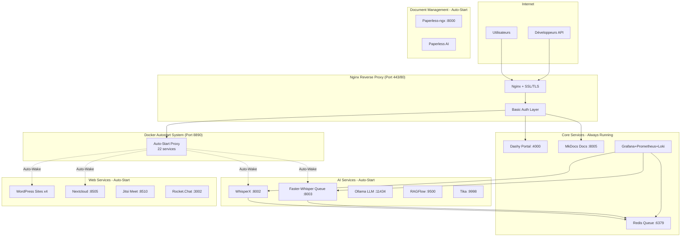

# Guide d'Entrée pour LLM - srv759970.hstgr.cloud

**Version:** 1.0
**Dernière mise à jour:** 2025-10-27
**Public cible:** Assistants IA (Claude, GPT, etc.) découvrant le serveur pour la première fois

---

## 🎯 Objectif de ce Document

Ce guide permet à un LLM de comprendre rapidement l'infrastructure srv759970, ses services, et de répondre efficacement aux questions de l'administrateur (Julien).

---

## 📋 Vue d'Ensemble - À Lire en Premier

### Identité du Serveur

- **Nom:** srv759970.hstgr.cloud
- **IP:** 69.62.108.82
- **Hébergeur:** Hostinger VPS
- **OS:** Ubuntu 24.04 LTS
- **Admin:** Julien Fernandez (propriétaire unique)
- **Accès SSH:** `ssh root@69.62.108.82`

### Type d'Infrastructure

**Serveur d'applications multi-services** hébergeant:
- 40+ conteneurs Docker
- 30+ services web/APIs
- Stack complète IA (transcription, TTS, LLM, RAG)
- Sites WordPress et applications métier
- Infrastructure de monitoring et collaboration

### Architecture Globale



---

## 🔑 Concepts Clés à Comprendre

### 1. Système Auto-Start/Stop (IMPORTANT!)

**Localisation:** `/opt/docker-autostart/`
**Fonction:** Économise la RAM en arrêtant les services inactifs après 15 minutes

**Services concernés:** 22 services sur 30+
**Port proxy:** 8890
**Mécanisme:**
1. Nginx reçoit requête → redirige vers port 8890
2. Auto-start proxy détecte service arrêté → le démarre
3. Affiche page de chargement pendant 30-180s
4. Redirige vers service actif
5. Après 15 min d'inactivité → arrête le service

**Services EXCLUS (toujours actifs):**
- Dashy (portail principal)
- MkDocs (documentation)
- Redis Queue (dépendance critique)
- Nginx (reverse proxy)
- Monitoring stack

### 2. Architecture d'Authentification

**Méthode:** HTTP Basic Authentication via Nginx
**Credentials:** `julien:DevAccess2025`
**Fichier:** `/etc/nginx/.htpasswd`
**Snippet:** `/etc/nginx/snippets/basic-auth.conf`

**Pourquoi Basic Auth et pas OAuth?**
→ Voir [Analyse Auth Strategy](analysis/auth-strategy-oauth-vs-basic.md)
**TL;DR:** Simplicité (0MB RAM, 5min setup) vs OAuth (300MB RAM, 4h setup) pour un usage solo

### 3. Organisation Docker

**Principe:** 1 service = 1 dossier `/opt/<service>/` avec `docker-compose.yml`

**Exemples:**
- `/opt/whisperx/` → WhisperX API
- `/opt/dashy/` → Dashy portal
- `/opt/wordpress-clemence/` → Site Clémence

**Commandes communes:**
```bash
cd /opt/<service>
docker-compose up -d      # Démarrer
docker-compose logs -f    # Voir logs
docker-compose restart    # Redémarrer
docker-compose down       # Arrêter
```

### 4. Stack de Transcription (AI Core)

**Architecture partagée:**
```
Redis Partagé (rq-queue-redis:6379)
├── DB 0: Queue "transcription" (WhisperX)
└── DB 1: Queue "faster-whisper-transcription"

WhisperX Worker → WhisperX API (:8002)
Faster-Whisper Worker → Faster-Whisper Queue API (:8003)
```

**Monitoring:**
- Grafana: https://monitoring.srv759970.hstgr.cloud
- RQ Dashboard: https://whisperx-dashboard.srv759970.hstgr.cloud
- Prometheus: http://srv759970.hstgr.cloud:9090

---

## 📚 Structure de la Documentation

### Navigation Rapide

| Section | Contenu | Quand l'utiliser |
|---------|---------|------------------|
| **[index.md](index.md)** | Vue d'ensemble, liens rapides | Point d'entrée, découverte |
| **[Services/](services/)** | Fiches techniques par service | "Comment utiliser X?" |
| **[Infrastructure/](infrastructure/)** | Docker, Nginx, Sécurité | "Comment ça fonctionne?" |
| **[Guides/](guides/)** | Tutoriels déploiement | "Comment faire Y?" |
| **[Reference/](reference/)** | Commandes, snippets | "Quelle commande pour Z?" |
| **[Changelog/](changelog/)** | Historique modifications | "Qu'est-ce qui a changé?" |
| **[Analysis/](analysis/)** | Décisions techniques | "Pourquoi ce choix?" |

### Pages Critiques à Connaître

1. **[SERVER_STATUS.md](SERVER_STATUS.md)** - État serveur en temps réel (auto-généré)
2. **[SERVICES_STATUS.md](SERVICES_STATUS.md)** - Statut de tous les services (auto-généré)
3. **[EMERGENCY_RUNBOOK.md](EMERGENCY_RUNBOOK.md)** - Procédures d'urgence
4. **[guides/getting-started/vps-initial-setup.md](guides/getting-started/vps-initial-setup.md)** - Setup complet du serveur

---

## 🚀 Services Principaux - Référence Rapide

### Intelligence Artificielle

| Service | URL | Port | Description | Auto-Start |
|---------|-----|------|-------------|------------|
| **WhisperX** | https://whisperx.srv759970.hstgr.cloud | 8002 | Transcription + diarization | ✅ |
| **Faster-Whisper Queue** | https://faster-whisper.srv759970.hstgr.cloud | 8003 | Transcription async avec RQ | ✅ |
| **Ollama** | http://srv759970.hstgr.cloud:11434 | 11434 | Inférence LLM locale | ❌ |
| **RAGFlow** | https://ragflow.srv759970.hstgr.cloud | 9500 | Plateforme RAG complète | ✅ |
| **Tika** | http://srv759970.hstgr.cloud:9998 | 9998 | Parsing documents | ✅ |
| **NeuTTS** | https://neutts-api.srv759970.hstgr.cloud | - | Synthèse vocale | ✅ |

### Collaboration

| Service | URL | Port | Description | Auto-Start |
|---------|-----|------|-------------|------------|
| **Nextcloud** | https://nextcloud.srv759970.hstgr.cloud | 8505 | Stockage cloud | ✅ |
| **Rocket.Chat** | https://chat.srv759970.hstgr.cloud | 3002 | Messagerie équipe | ✅ |
| **Jitsi Meet** | https://meet.srv759970.hstgr.cloud | 8510 | Visioconférence | ✅ |

### Infrastructure

| Service | URL | Port | Description | Auto-Start |
|---------|-----|------|-------------|------------|
| **Dashy** | https://dashy.srv759970.hstgr.cloud | 4000 | Portail services | ❌ Always ON |
| **MkDocs** | https://docs.srv759970.hstgr.cloud | 8005 | Documentation | ❌ Always ON |
| **Grafana** | https://monitoring.srv759970.hstgr.cloud | 3001 | Monitoring | ❌ Always ON |
| **Dozzle** | https://dozzle.srv759970.hstgr.cloud | 8888 | Logs Docker | ❌ Always ON |
| **Portainer** | https://portainer.srv759970.hstgr.cloud | 9000 | Gestion Docker | ❌ Always ON |

---

## 🔍 Patterns de Questions Fréquentes

### "Comment redémarrer le service X?"

```bash
ssh root@69.62.108.82
cd /opt/<service-name>
docker-compose restart
```

**Exemples concrets:**
- WhisperX: `cd /opt/whisperx && docker-compose restart`
- Dashy: `cd /opt/dashy && docker-compose restart`
- Nextcloud: `cd /opt/nextcloud && docker-compose restart`

### "Le service X ne répond pas"

**Checklist de diagnostic:**
1. Vérifier si auto-start (attendre 30-180s de chargement)
2. Vérifier logs: `docker logs <container-name> --tail 50`
3. Vérifier statut: `docker ps | grep <service>`
4. Vérifier Nginx: `nginx -t && systemctl status nginx`
5. Voir [EMERGENCY_RUNBOOK.md](EMERGENCY_RUNBOOK.md)

### "Comment ajouter un nouveau service?"

**Template standard:**
1. Créer `/opt/<service>/docker-compose.yml`
2. Configurer Nginx dans `/etc/nginx/sites-available/<service>`
3. Activer: `ln -s /etc/nginx/sites-available/<service> /etc/nginx/sites-enabled/`
4. Tester: `nginx -t`
5. Recharger: `systemctl reload nginx`
6. (Optionnel) Ajouter à auto-start dans `/opt/docker-autostart/config.json`

→ Voir [guides/deployment/](guides/deployment/) pour détails

### "Quelle est la différence entre WhisperX et Faster-Whisper Queue?"

| Critère | WhisperX | Faster-Whisper Queue |
|---------|----------|----------------------|
| **Modèle** | large-v2 | medium |
| **Diarization** | ✅ Oui (qui parle quand) | ❌ Non |
| **Vitesse** | Plus lent | Plus rapide |
| **Précision** | Meilleure | Bonne |
| **Use case** | Transcription précise avec speakers | Transcription rapide simple |
| **Queue Redis** | DB 0 | DB 1 |

→ Voir [services/ai/whisperx.md](services/ai/whisperx.md) et [services/ai/faster-whisper-queue.md](services/ai/faster-whisper-queue.md)

---

## 🎓 Workflow Recommandé pour un LLM

### Première Requête de l'Utilisateur

1. **Lire** `LLM_ONBOARDING.md` (ce fichier) - Vue d'ensemble
2. **Lire** `index.md` - État actuel des services
3. **Lire** `SERVER_STATUS.md` et `SERVICES_STATUS.md` - Statut live

### Requête Technique sur un Service

1. **Lire** `services/<categorie>/<service>.md` - Fiche technique
2. **Lire** `guides/services/<categorie>/<service>-*.md` - Guides détaillés
3. **Référence** `reference/docker/commands.md` ou `reference/nginx/` si besoin

### Problème / Dépannage

1. **Lire** `EMERGENCY_RUNBOOK.md` - Procédures d'urgence
2. **Lire** `guides/infrastructure/nginx-troubleshooting.md`
3. **Référence** `changelog/` pour historique récent

### Déploiement / Modification

1. **Lire** `guides/deployment/` - Guides de déploiement
2. **Référence** `reference/docker/compose-patterns.md` - Templates
3. **Lire** `analysis/` pour comprendre les choix techniques

---

## ⚠️ Pièges Courants à Éviter

### 1. Ne Pas Confondre Auto-Start et Always-On

**Erreur courante:** "Dashy ne répond pas" → Suggérer d'attendre le démarrage auto-start
**Réalité:** Dashy est ALWAYS-ON, si ça ne répond pas, c'est un vrai problème

**Services Always-On (ne jamais dire "attends le démarrage"):**
- Dashy, MkDocs, Grafana, Redis Queue, Nginx, Dozzle, Portainer

**Services Auto-Start (OK de dire "attends 30-180s"):**
- WhisperX, Faster-Whisper, WordPress, Nextcloud, Jitsi, Rocket.Chat, etc.

### 2. Ne Pas Modifier Nginx Sans Tester

**Toujours inclure ces commandes après modification Nginx:**
```bash
nginx -t                    # Tester la config
systemctl reload nginx      # Recharger si OK
```

### 3. Status Checks de Dashy Désactivés

**Contexte:** Dashy avait des status checks qui empêchaient l'auto-stop
**Solution:** Status checks SUPPRIMÉS (pas désactivés, SUPPRIMÉS)
**Référence:** [changelog/dashy-autostart-fix-2025-10-24.md](changelog/dashy-autostart-fix-2025-10-24.md)

**Ne JAMAIS suggérer de réactiver les status checks dans Dashy sans mentionner le conflit auto-stop!**

### 4. Redis Queue Partagé - Ne Pas Redémarrer à la Légère

**Important:** Redis Queue (`rq-queue-redis`) est partagé par WhisperX ET Faster-Whisper
**Impact d'un restart:** Perte des jobs en cours dans les 2 queues

**Commande safe pour voir les queues:**
```bash
docker exec -it rq-queue-redis redis-cli
SELECT 0  # WhisperX
LLEN transcription
SELECT 1  # Faster-Whisper
LLEN faster-whisper-transcription
```

---

## 📊 Métriques Clés du Serveur

### Ressources

- **RAM Total:** 32GB
- **CPU:** 8 vCPUs
- **Disque:** 400GB SSD
- **Conteneurs actifs:** ~15-25 (varie avec auto-start)
- **Conteneurs total:** ~40

### Limites Connues

- **Max conteneurs simultanés:** ~40 (incident Netdata à 59 conteneurs)
- **RAM critique:** >28GB → Risque OOM
- **Auto-stop timeout:** 15 minutes (900s)
- **Auto-start boot time:** 30-180s selon service

---

## 🔗 Liens Utiles pour le LLM

### Dashboards Live

- **Dashy:** https://dashy.srv759970.hstgr.cloud - Vue d'ensemble tous services
- **Grafana:** https://monitoring.srv759970.hstgr.cloud - Métriques & logs
- **Dozzle:** https://dozzle.srv759970.hstgr.cloud - Logs Docker temps réel

### Documentation Externe

- **Dashy Docs:** https://dashy.to/docs
- **MkDocs Material:** https://squidfunk.github.io/mkdocs-material/
- **Docker Compose:** https://docs.docker.com/compose/
- **Nginx:** https://nginx.org/en/docs/

---

## 🆘 En Cas de Doute

**Si tu ne sais pas comment répondre:**

1. Consulter `EMERGENCY_RUNBOOK.md` pour urgences
2. Chercher dans `changelog/` pour historique récent
3. Lire `analysis/` pour comprendre les décisions
4. Proposer de lire les logs: `docker logs <service> --tail 100`
5. Demander à Julien de vérifier `SERVER_STATUS.md` (auto-généré)

**Principe:** Mieux vaut demander confirmation que donner une mauvaise info sur un serveur de production!

---

## 📝 Changelog de ce Guide

- **2025-10-27:** Création initiale du guide d'onboarding LLM
- **Prochaine révision:** Après premier usage réel par un LLM

---

**Bienvenue sur srv759970! 🚀**

*Ce guide est maintenu manuellement. Si tu détectes une incohérence avec les autres docs, signale-le à Julien.*
