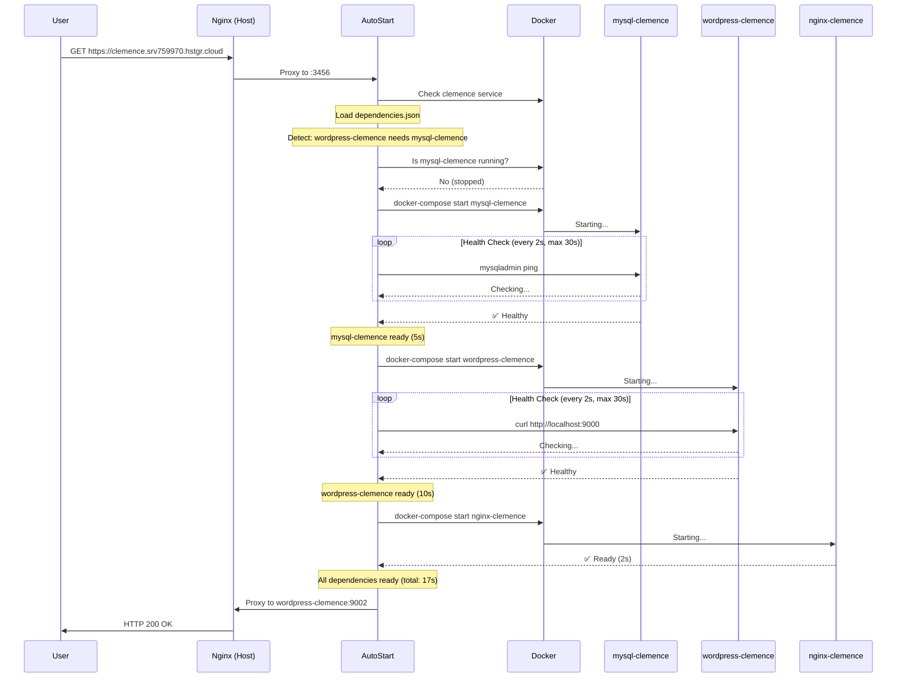

# Chaîne de Réveil des Dépendances - Proposition de Design

Analyse et proposition d'implémentation d'un système de réveil intelligent basé sur les dépendances entre services.

---

## 🎯 Problématique

**Situation actuelle** :
- L'utilisateur accède à `clemence.srv759970.hstgr.cloud`
- `wordpress-clemence` démarre
- ❌ Mais `mysql-clemence` reste arrêté
- ❌ WordPress crash ou timeout en attendant MySQL

**Solution attendue** :
- L'utilisateur accède à `clemence.srv759970.hstgr.cloud`
- Le système détecte les dépendances : `wordpress-clemence` → `mysql-clemence`
- ✅ `mysql-clemence` démarre en premier
- ✅ Ensuite `wordpress-clemence` démarre
- ✅ L'utilisateur accède au site fonctionnel

---

## 📊 Analyse des Dépendances Actuelles

### Services avec Dépendances Critiques

```mermaid
graph TB
    subgraph "WordPress Clemence"
        WP_Clem[wordpress-clemence<br/>Port: 9002]
        Nginx_Clem[nginx-clemence]
        MySQL_Clem[mysql-clemence<br/>Port: 3306]
        WPCli_Clem[wp-cli-clemence]
    end

    subgraph "Nextcloud"
        NC[nextcloud<br/>Port: 8080]
        NC_Cron[nextcloud-cron]
        NC_DB[postgresql-shared<br/>Réseau: databases-shared]
        NC_Redis[redis-shared<br/>Réseau: databases-shared]
    end

    subgraph "RAGFlow"
        RAG_Server[ragflow-server<br/>Port: 9500]
        RAG_ES[ragflow-es-01]
        RAG_MySQL[ragflow-mysql]
        RAG_Redis[ragflow-redis]
        RAG_Minio[ragflow-minio]
    end

    subgraph "MemVid"
        MemVid_API[memvid-api<br/>Port: 8100]
        MemVid_UI[memvid-ui]
        Redis_Shared[redis-shared]
    end

    subgraph "Telegram Voice Bot"
        TG_Bot[telegram-voice-bot]
        Whisper[faster-whisper-worker]
        WhisperX[rq-exporter-whisperx]
        Redis_Shared2[redis-shared]
    end

    WP_Clem --> MySQL_Clem
    Nginx_Clem --> WP_Clem
    WPCli_Clem --> MySQL_Clem

    NC --> NC_DB
    NC --> NC_Redis
    NC_Cron --> NC

    RAG_Server --> RAG_ES
    RAG_Server --> RAG_MySQL
    RAG_Server --> RAG_Redis
    RAG_Server --> RAG_Minio

    MemVid_API --> Redis_Shared
    MemVid_UI --> MemVid_API

    TG_Bot --> Redis_Shared2
    TG_Bot --> Whisper
    TG_Bot --> WhisperX

    style MySQL_Clem fill:#ff6b6b
    style NC_DB fill:#4ecdc4
    style NC_Redis fill:#ffd93d
    style RAG_MySQL fill:#ff6b6b
    style RAG_Redis fill:#ffd93d
    style RAG_ES fill:#a8e6cf
    style Redis_Shared fill:#ffd93d
```



---

## 🔗 Graphe de Dépendances Détaillé

### 1. WordPress Clemence

**Réseau** : `wordpress-clemence_clemence-network`

```yaml
wordpress-clemence:
  depends_on:
    - mysql-clemence
  start_order: 2
  health_check_wait: mysql-clemence

nginx-clemence:
  depends_on:
    - wordpress-clemence
  start_order: 3

mysql-clemence:
  start_order: 1
  health_check: "mysqladmin ping -h localhost"
  startup_time: ~5s
```

**Chaîne de réveil** :
```
User → wordpress-clemence → mysql-clemence (starts first) → wordpress-clemence (starts) → nginx-clemence (starts)
```

---

### 2. Nextcloud

**Réseau** : `nextcloud` + `databases-shared`

```yaml
nextcloud:
  depends_on:
    - postgresql-shared  # Cross-network dependency
    - redis-shared       # Cross-network dependency
  start_order: 3
  health_check_wait:
    - postgresql-shared
    - redis-shared

nextcloud-cron:
  depends_on:
    - nextcloud
  start_order: 4

postgresql-shared:
  start_order: 1
  health_check: "pg_isready"
  startup_time: ~8s

redis-shared:
  start_order: 1
  health_check: "redis-cli ping"
  startup_time: ~2s
```

**Chaîne de réveil** :
```
User → nextcloud → [postgresql-shared, redis-shared] (parallel) → nextcloud → nextcloud-cron
```

---

### 3. RAGFlow Cluster

**Réseau** : `docker_ragflow`

```yaml
ragflow-server:
  depends_on:
    - ragflow-es-01
    - ragflow-mysql
    - ragflow-redis
    - ragflow-minio
  start_order: 5
  health_check_wait: all

ragflow-es-01:
  start_order: 1
  health_check: "curl -f http://localhost:9200/_cluster/health"
  startup_time: ~30s

ragflow-mysql:
  start_order: 1
  health_check: "mysqladmin ping"
  startup_time: ~8s

ragflow-redis:
  start_order: 1
  health_check: "redis-cli ping"
  startup_time: ~3s

ragflow-minio:
  start_order: 1
  health_check: "curl -f http://localhost:9000/minio/health/ready"
  startup_time: ~5s
```

**Chaîne de réveil** :
```
User → ragflow-server → [ragflow-es-01, ragflow-mysql, ragflow-redis, ragflow-minio] (parallel)
                      → wait all healthy (max 30s for ES)
                      → ragflow-server starts
```

---

### 4. MemVid

**Réseau** : `memvid_memvid-network` + `monitoring_monitoring`

```yaml
memvid-api:
  depends_on:
    - redis-shared  # Cross-network dependency
  start_order: 2
  health_check_wait: redis-shared

memvid-ui:
  depends_on:
    - memvid-api
  start_order: 3

redis-shared:
  start_order: 1
  startup_time: ~2s
```

**Chaîne de réveil** :
```
User → memvid-ui → memvid-api → redis-shared (cross-network) → memvid-api → memvid-ui
```

---

## 🛠️ Implémentation Proposée

### Structure de Configuration

**Nouveau fichier** : `/opt/docker-autostart/dependencies.json`

```json
{
  "services": {
    "clemence": {
      "name": "wordpress-clemence",
      "port": 9002,
      "composeDir": "/opt/wordpress-clemence",
      "network": "wordpress-clemence_clemence-network",
      "dependencies": [
        {
          "container": "mysql-clemence",
          "type": "required",
          "startOrder": 1,
          "healthCheck": {
            "command": "docker exec mysql-clemence mysqladmin ping -h localhost -u root -p$MYSQL_ROOT_PASSWORD",
            "interval": 2000,
            "timeout": 30000,
            "retries": 15
          }
        },
        {
          "container": "wordpress-clemence",
          "type": "required",
          "startOrder": 2,
          "healthCheck": {
            "command": "docker exec wordpress-clemence curl -f http://localhost:9000/wp-admin/install.php",
            "interval": 2000,
            "timeout": 30000,
            "retries": 10
          }
        },
        {
          "container": "nginx-clemence",
          "type": "optional",
          "startOrder": 3,
          "healthCheck": {
            "command": "docker exec nginx-clemence curl -f http://localhost:80",
            "interval": 1000,
            "timeout": 10000,
            "retries": 5
          }
        }
      ]
    },
    "nextcloud": {
      "name": "nextcloud",
      "port": 8080,
      "composeDir": "/opt/nextcloud",
      "network": "nextcloud",
      "crossNetworkDeps": true,
      "dependencies": [
        {
          "container": "postgresql-shared",
          "network": "databases-shared",
          "type": "required",
          "startOrder": 1,
          "healthCheck": {
            "command": "docker exec postgresql-shared pg_isready -U postgres",
            "interval": 2000,
            "timeout": 30000,
            "retries": 15
          }
        },
        {
          "container": "redis-shared",
          "network": "databases-shared",
          "type": "required",
          "startOrder": 1,
          "healthCheck": {
            "command": "docker exec redis-shared redis-cli ping",
            "interval": 1000,
            "timeout": 10000,
            "retries": 10
          }
        },
        {
          "container": "nextcloud",
          "type": "required",
          "startOrder": 2,
          "healthCheck": {
            "command": "docker exec nextcloud curl -f http://localhost:80/status.php",
            "interval": 3000,
            "timeout": 60000,
            "retries": 20
          }
        },
        {
          "container": "nextcloud-cron",
          "type": "optional",
          "startOrder": 3
        }
      ]
    },
    "ragflow": {
      "name": "ragflow-server",
      "port": 9500,
      "composeDir": "/opt/ragflow",
      "network": "docker_ragflow",
      "dependencies": [
        {
          "container": "ragflow-mysql",
          "type": "required",
          "startOrder": 1,
          "parallelGroup": 1,
          "healthCheck": {
            "command": "docker exec ragflow-mysql mysqladmin ping -h localhost",
            "interval": 2000,
            "timeout": 30000,
            "retries": 15
          }
        },
        {
          "container": "ragflow-redis",
          "type": "required",
          "startOrder": 1,
          "parallelGroup": 1,
          "healthCheck": {
            "command": "docker exec ragflow-redis redis-cli ping",
            "interval": 1000,
            "timeout": 10000,
            "retries": 10
          }
        },
        {
          "container": "ragflow-minio",
          "type": "required",
          "startOrder": 1,
          "parallelGroup": 1,
          "healthCheck": {
            "command": "docker exec ragflow-minio curl -f http://localhost:9000/minio/health/ready",
            "interval": 2000,
            "timeout": 30000,
            "retries": 15
          }
        },
        {
          "container": "ragflow-es-01",
          "type": "required",
          "startOrder": 1,
          "parallelGroup": 1,
          "healthCheck": {
            "command": "docker exec ragflow-es-01 curl -f http://localhost:9200/_cluster/health",
            "interval": 3000,
            "timeout": 60000,
            "retries": 20
          }
        },
        {
          "container": "ragflow-server",
          "type": "required",
          "startOrder": 2,
          "healthCheck": {
            "command": "docker exec ragflow-server curl -f http://localhost:9380/health",
            "interval": 3000,
            "timeout": 90000,
            "retries": 30
          }
        }
      ]
    },
    "memvid": {
      "name": "memvid-api",
      "port": 8100,
      "composeDir": "/opt/memvid",
      "network": "memvid_memvid-network",
      "crossNetworkDeps": true,
      "dependencies": [
        {
          "container": "redis-shared",
          "network": "monitoring_monitoring",
          "type": "required",
          "startOrder": 1,
          "healthCheck": {
            "command": "docker exec redis-shared redis-cli ping",
            "interval": 1000,
            "timeout": 10000,
            "retries": 10
          }
        },
        {
          "container": "memvid-api",
          "type": "required",
          "startOrder": 2,
          "healthCheck": {
            "command": "docker exec memvid-api curl -f http://localhost:8100/health",
            "interval": 2000,
            "timeout": 30000,
            "retries": 15
          }
        },
        {
          "container": "memvid-ui",
          "type": "optional",
          "startOrder": 3
        }
      ]
    }
  }
}
```

---

## 🚀 Algorithme de Réveil

### Pseudo-code

```javascript
async function wakeServiceWithDependencies(serviceName) {
  const service = dependencies.services[serviceName];

  // 1. Charger la configuration des dépendances
  const depGraph = loadDependencyGraph(service);

  // 2. Trier les dépendances par startOrder
  const sortedDeps = topologicalSort(depGraph);

  // 3. Grouper par parallelGroup
  const parallelGroups = groupByParallelGroup(sortedDeps);

  // 4. Démarrer groupe par groupe
  for (const group of parallelGroups) {
    const startPromises = [];

    for (const dep of group) {
      // Vérifier si déjà running
      if (await isContainerRunning(dep.container)) {
        console.log(`✅ ${dep.container} already running`);
        continue;
      }

      // Démarrer le conteneur
      console.log(`🚀 Starting ${dep.container}...`);
      const startPromise = startContainer(dep);

      if (dep.type === 'required') {
        startPromises.push(startPromise);
      } else {
        // Fire and forget pour les optionnels
        startPromise.catch(err => console.warn(`⚠️  Optional ${dep.container} failed:`, err));
      }
    }

    // Attendre que tous les conteneurs required du groupe soient ready
    await Promise.all(startPromises);
    console.log(`✅ Group ${group[0].startOrder} ready`);
  }

  console.log(`✅ Service ${serviceName} and all dependencies are ready`);
}

async function startContainer(dep) {
  // 1. Démarrer le conteneur
  await dockerComposeStart(dep.container, dep.composeDir);

  // 2. Attendre le health check si défini
  if (dep.healthCheck) {
    await waitForHealthy(dep);
  } else {
    // Attendre un délai par défaut
    await sleep(5000);
  }
}

async function waitForHealthy(dep) {
  const { command, interval, timeout, retries } = dep.healthCheck;
  const startTime = Date.now();

  for (let i = 0; i < retries; i++) {
    try {
      // Exécuter la commande de health check
      await exec(command);
      console.log(`✅ ${dep.container} is healthy`);
      return;
    } catch (err) {
      const elapsed = Date.now() - startTime;

      if (elapsed >= timeout) {
        throw new Error(`Timeout waiting for ${dep.container} (${elapsed}ms)`);
      }

      console.log(`⏳ ${dep.container} not ready yet (attempt ${i+1}/${retries})...`);
      await sleep(interval);
    }
  }

  throw new Error(`${dep.container} failed health check after ${retries} attempts`);
}
```

---

## 📊 Exemple de Flux : WordPress Clemence

### Étape par Étape



**Temps total** : ~17s (au lieu de timeout ou erreur)

---

## 🎨 Interface Utilisateur Améliorée

### Page d'Attente Dynamique avec Progression

```html
<!DOCTYPE html>
<html>
<head>
    <title>Starting WordPress Clemence...</title>
    <style>
        .progress-container {
            width: 80%;
            margin: 50px auto;
        }
        .dependency {
            margin: 20px 0;
            padding: 15px;
            border-radius: 8px;
            background: #f5f5f5;
        }
        .dependency.pending { background: #fff3cd; }
        .dependency.starting { background: #cfe2ff; }
        .dependency.ready { background: #d1e7dd; }
        .dependency.error { background: #f8d7da; }
    </style>
</head>
<body>
    <div class="progress-container">
        <h1>🚀 Starting WordPress Clemence</h1>
        <p>Démarrage des dépendances en cours...</p>

        <div id="mysql" class="dependency starting">
            <strong>📦 mysql-clemence</strong>
            <div>Status: Starting... (5s estimated)</div>
            <div class="progress-bar">
                <div class="progress" style="width: 0%"></div>
            </div>
        </div>

        <div id="wordpress" class="dependency pending">
            <strong>📦 wordpress-clemence</strong>
            <div>Status: Waiting for mysql-clemence...</div>
        </div>

        <div id="nginx" class="dependency pending">
            <strong>📦 nginx-clemence</strong>
            <div>Status: Waiting for wordpress-clemence...</div>
        </div>

        <div class="total-time">
            <strong>Temps total estimé:</strong> ~17 secondes
        </div>
    </div>

    <script>
        // SSE pour recevoir les updates en temps réel
        const eventSource = new EventSource('/api/wake-status/clemence');

        eventSource.addEventListener('dependency-update', (event) => {
            const data = JSON.parse(event.data);
            updateDependency(data.container, data.status, data.progress);
        });

        function updateDependency(container, status, progress) {
            const elem = document.getElementById(container);
            elem.className = `dependency ${status}`;
            elem.querySelector('.progress').style.width = `${progress}%`;

            if (status === 'ready') {
                elem.querySelector('div:nth-child(2)').textContent = '✅ Ready!';
            }
        }
    </script>
</body>
</html>
```

---

## 📈 Temps de Démarrage Estimés

| Service | Dépendances | Temps Séquentiel | Temps Optimisé (Parallel) |
|---------|-------------|------------------|---------------------------|
| **WordPress Clemence** | mysql-clemence | 5s + 10s = **15s** | **15s** (sequential) |
| **Nextcloud** | postgresql + redis | 8s + 2s + 15s = **25s** | 8s + 15s = **23s** (postgres start first) |
| **RAGFlow** | ES + MySQL + Redis + Minio | 30s + 8s + 3s + 5s + 45s = **91s** | 30s + 45s = **75s** (all deps parallel) |
| **MemVid** | redis-shared | 2s + 5s = **7s** | **7s** (sequential) |

**Gains de temps** :
- WordPress : Pas de gain mais **évite les erreurs**
- Nextcloud : **-2s** (8%)
- RAGFlow : **-16s** (18%)
- MemVid : **Évite les erreurs Redis**

---

## 🔧 Migration et Déploiement

### Étape 1 : Analyser les dépendances existantes

```bash
# Script pour générer dependencies.json automatiquement
python scripts/utils/generate-dependencies-config.py

# Sortie : /opt/docker-autostart/dependencies.json
```

### Étape 2 : Tester le nouveau système

```bash
# Test en mode dry-run
curl -X POST http://localhost:3456/api/wake/clemence?dryRun=true

# Sortie :
{
  "service": "clemence",
  "dependencies": [
    {"container": "mysql-clemence", "order": 1, "estimatedTime": "5s"},
    {"container": "wordpress-clemence", "order": 2, "estimatedTime": "10s"},
    {"container": "nginx-clemence", "order": 3, "estimatedTime": "2s"}
  ],
  "totalEstimatedTime": "17s",
  "parallel": false
}
```

### Étape 3 : Déployer graduellement

```bash
# 1. Déployer sur 1 service test (Clemence)
systemctl restart docker-autostart

# 2. Tester
curl https://clemence.srv759970.hstgr.cloud

# 3. Monitorer les logs
journalctl -u docker-autostart -f | grep "dependency"

# 4. Si OK, déployer sur tous les services
# Éditer dependencies.json pour ajouter nextcloud, ragflow, etc.
```

---

## 🚨 Gestion des Erreurs

### Scénarios d'Échec

**1. Dépendance required échoue**
```javascript
if (dep.type === 'required' && !healthy) {
  // Arrêter tout et notifier l'utilisateur
  await stopAllStartedContainers();
  throw new Error(`Critical dependency ${dep.container} failed`);
}
```

**2. Dépendance optional échoue**
```javascript
if (dep.type === 'optional' && !healthy) {
  // Logger warning mais continuer
  console.warn(`Optional ${dep.container} failed, continuing anyway`);
}
```

**3. Timeout global**
```javascript
const globalTimeout = 5 * 60 * 1000; // 5 minutes max
const timeoutPromise = new Promise((_, reject) =>
  setTimeout(() => reject(new Error('Global timeout')), globalTimeout)
);

await Promise.race([
  wakeServiceWithDependencies(serviceName),
  timeoutPromise
]);
```

---

## 📊 Monitoring et Métriques

### Nouvelles Métriques à Tracker

```javascript
// Prometheus metrics
dependency_wake_duration_seconds{service="clemence", dependency="mysql-clemence"}
dependency_wake_success_total{service="clemence"}
dependency_wake_failure_total{service="clemence", reason="health_check_failed"}
dependency_wake_parallel_efficiency{service="ragflow"}
```

### Dashboard Grafana

Panels à créer :
- **Temps de réveil par service** (avg, p95, p99)
- **Taux de succès des dépendances**
- **Top services lents** (dépendances qui ralentissent)
- **Efficiency du parallélisme** (temps gagné)

---

## 🚀 Évolutions Futures

### Phase 1 : MVP (Janvier 2026)
- ✅ Dépendances simples (same network)
- ✅ Health checks basiques
- ✅ Gestion erreurs required vs optional
- ✅ Logs structurés

### Phase 2 : Optimisations (Février 2026)
- ✅ Dépendances cross-network
- ✅ Démarrage parallèle (parallelGroup)
- ✅ Cache des états (éviter re-checks)
- ✅ Retry logic intelligent

### Phase 3 : Intelligence (Mars 2026)
- ✅ Prédiction temps de démarrage ML
- ✅ Pre-warming proactif des dépendances
- ✅ Auto-tuning des health checks
- ✅ Dependency graph visualization UI

---

## 📚 Ressources

- [Architecture Docker](../infrastructure/docker-architecture.md)
- [Stratégie Auto-Stop](./docker-autostop-strategy.md)
- [Script d'analyse](../../scripts/README.md#monitoring-analyze-docker-dependenciespy)

---

**Date de proposition** : 2025-10-27
**Auteur** : Infrastructure Team
**Status** : ⏳ En analyse
