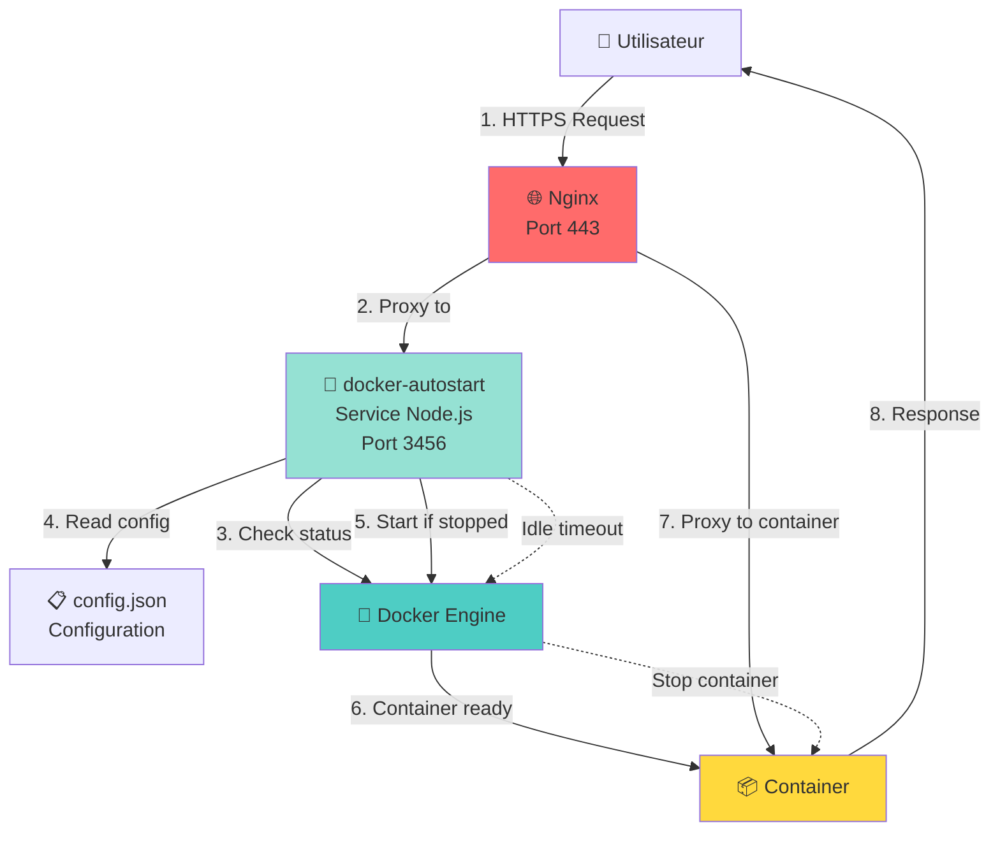
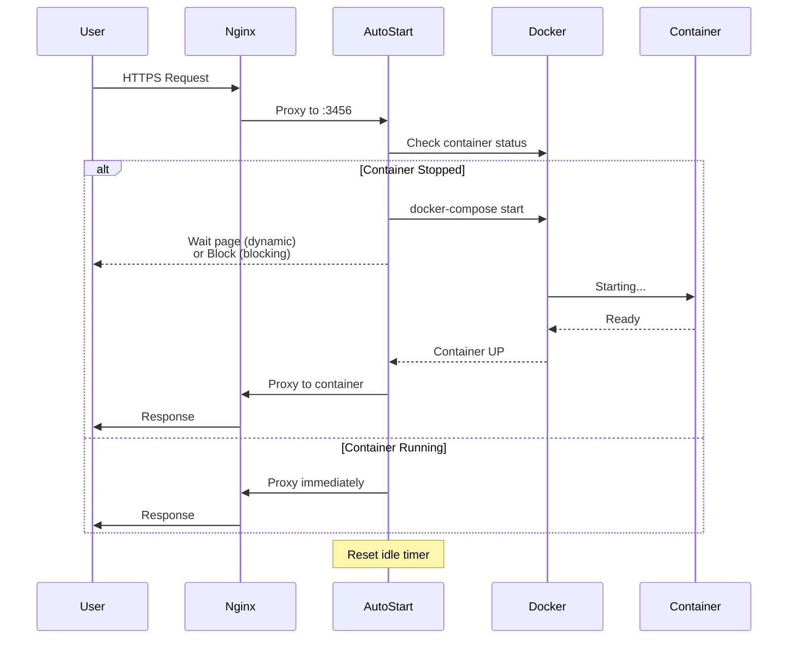
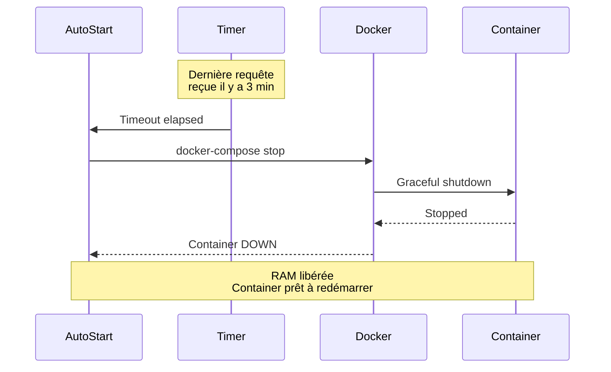

# Stratégie Auto-Stop Docker - Optimisation RAM

Guide complet de la stratégie d'auto-stop des conteneurs Docker pour optimiser l'utilisation de la RAM sur srv759970.

---

## 🎯 Objectif

Réduire la consommation RAM du serveur en arrêtant automatiquement les services peu utilisés et en les redémarrant à la demande.

**Impact réel** :
- **Avant** : 7.1GB / 8GB utilisés (89%)
- **Après** : 2.4GB / 8GB utilisés (30%)
- **Économie** : **4.7GB (66%)**

---

## 🏗️ Architecture du Système

### Composants



---

## 📋 Configuration

### Fichier de Configuration

**Emplacement** : `/opt/docker-autostart/config.json`

```json
{
  "services": [
    {
      "name": "ragflow",
      "port": 9500,
      "timeout": 180000,
      "mode": "dynamic",
      "themeName": "matrix",
      "composeDir": "/opt/ragflow"
    },
    {
      "name": "xtts",
      "port": 8020,
      "timeout": 180000,
      "mode": "blocking",
      "composeDir": "/opt/xtts-api-server"
    },
    {
      "name": "paperless",
      "port": 8000,
      "timeout": 180000,
      "mode": "dynamic",
      "themeName": "ghost",
      "composeDir": "/opt/paperless-ngx"
    },
    {
      "name": "nextcloud",
      "port": 8080,
      "timeout": 180000,
      "mode": "dynamic",
      "themeName": "ghost",
      "composeDir": "/opt/nextcloud"
    },
    {
      "name": "memvid",
      "port": 8100,
      "timeout": 180000,
      "mode": "blocking",
      "composeDir": "/opt/memvid"
    },
    {
      "name": "jitsi",
      "port": 8443,
      "timeout": 180000,
      "mode": "blocking",
      "composeDir": "/opt/jitsi-meet"
    },
    {
      "name": "clemence",
      "port": 9002,
      "timeout": 180000,
      "mode": "dynamic",
      "themeName": "ghost",
      "composeDir": "/opt/wordpress-clemence"
    },
    {
      "name": "solidarlink",
      "port": 9001,
      "timeout": 180000,
      "mode": "dynamic",
      "themeName": "hackerTerminal",
      "composeDir": "/var/www/solidarlink"
    }
  ]
}
```

### Paramètres Expliqués

| Paramètre | Type | Description | Exemple |
|-----------|------|-------------|---------|
| `name` | string | Identifiant unique du service | `"ragflow"` |
| `port` | number | Port d'écoute du service | `9500` |
| `timeout` | number | Délai d'inactivité en ms avant auto-stop | `180000` (3 min) |
| `mode` | string | Mode d'affichage (`dynamic` ou `blocking`) | `"dynamic"` |
| `themeName` | string | Thème de la page d'attente (si mode dynamic) | `"matrix"` |
| `composeDir` | string | Chemin vers le docker-compose.yml | `"/opt/ragflow"` |

---

## 🎨 Modes de Fonctionnement

### Mode Dynamic

Affiche une **page d'attente animée** pendant le démarrage du conteneur.

**Caractéristiques** :
- ✅ Meilleure UX (l'utilisateur voit une progression)
- ✅ Design personnalisable (thèmes)
- ✅ Estimation du temps de démarrage
- ❌ Nécessite JavaScript côté client

**Thèmes disponibles** :
- `matrix` - Effet Matrix (code vert défilant)
- `ghost` - Fantôme animé minimaliste
- `shuffle` - Cartes qui se mélangent
- `hackerTerminal` - Terminal de hacker rétro

**Cas d'usage** : Sites web, dashboards, applications avec UI

**Services utilisant ce mode** :
- RAGFlow (theme: matrix)
- Paperless (theme: ghost)
- Nextcloud (theme: ghost)
- WordPress Clemence (theme: ghost)
- WordPress SolidarLink (theme: hackerTerminal)

---

### Mode Blocking

Attend **silencieusement** que le conteneur démarre avant de répondre.

**Caractéristiques** :
- ✅ Compatible avec tous les clients (pas de JS requis)
- ✅ Transparent pour les APIs
- ✅ Timeout configurable
- ❌ Pas de feedback visuel pendant l'attente

**Cas d'usage** : APIs REST, webhooks, services backend

**Services utilisant ce mode** :
- XTTS-API (API vocale)
- MemVid (API de recherche)
- Jitsi (WebRTC, incompatible avec page d'attente)

---

## 🔄 Flux de Travail

### Démarrage à la Demande



---

### Auto-Stop par Inactivité



---

## 🚀 Déploiement

### Installation Initiale

```bash
# 1. Cloner le repo docker-autostart
cd /opt
git clone https://github.com/your-org/docker-autostart.git
cd docker-autostart

# 2. Installer les dépendances
npm install

# 3. Créer le fichier de configuration
cp config.example.json config.json
nano config.json  # Éditer selon vos services

# 4. Tester manuellement
npm start

# 5. Créer le service systemd
sudo nano /etc/systemd/system/docker-autostart.service
```

**Fichier systemd** :
```ini
[Unit]
Description=Docker Auto-Start Service
After=docker.service
Requires=docker.service

[Service]
Type=simple
User=root
WorkingDirectory=/opt/docker-autostart
ExecStart=/usr/bin/node /opt/docker-autostart/server.js
Restart=always
RestartSec=10

[Install]
WantedBy=multi-user.target
```

```bash
# 6. Activer et démarrer
sudo systemctl daemon-reload
sudo systemctl enable docker-autostart
sudo systemctl start docker-autostart

# 7. Vérifier le statut
sudo systemctl status docker-autostart
```

---

### Configuration Nginx

Chaque service doit être configuré pour proxifier vers docker-autostart.

**Exemple pour RAGFlow** :
```nginx
# /etc/nginx/sites-available/ragflow

upstream docker_autostart_ragflow {
    server 127.0.0.1:3456;
}

server {
    listen 443 ssl http2;
    server_name ragflow.srv759970.hstgr.cloud;

    ssl_certificate /etc/letsencrypt/live/ragflow.srv759970.hstgr.cloud/fullchain.pem;
    ssl_certificate_key /etc/letsencrypt/live/ragflow.srv759970.hstgr.cloud/privkey.pem;

    # Proxy vers docker-autostart (qui gère le démarrage)
    location / {
        proxy_pass http://docker_autostart_ragflow;
        proxy_http_version 1.1;

        proxy_set_header Host $host;
        proxy_set_header X-Real-IP $remote_addr;
        proxy_set_header X-Forwarded-For $proxy_add_x_forwarded_for;
        proxy_set_header X-Forwarded-Proto $scheme;

        # Headers pour le service auto-start
        proxy_set_header X-Service-Name ragflow;
        proxy_set_header X-Target-Port 9500;

        # Timeouts augmentés pour le démarrage
        proxy_connect_timeout 300s;
        proxy_send_timeout 300s;
        proxy_read_timeout 300s;
    }
}
```

**Headers critiques** :
- `X-Service-Name` : Nom du service dans config.json
- `X-Target-Port` : Port du conteneur cible

---

### Ajout d'un Nouveau Service

```bash
# 1. Éditer la config
nano /opt/docker-autostart/config.json

# Ajouter :
{
  "name": "mon-service",
  "port": 8080,
  "timeout": 180000,
  "mode": "dynamic",
  "themeName": "ghost",
  "composeDir": "/opt/mon-service"
}

# 2. Redémarrer docker-autostart
systemctl restart docker-autostart

# 3. Configurer Nginx
nano /etc/nginx/sites-available/mon-service

# 4. Activer le site
ln -s /etc/nginx/sites-available/mon-service /etc/nginx/sites-enabled/
nginx -t
systemctl reload nginx

# 5. Tester
curl -I https://mon-service.srv759970.hstgr.cloud
```

---

## 📊 Monitoring

### Vérifier l'État des Services

```bash
# Script dédié
bash scripts/deployment/check-autostart-status.sh

# Sortie exemple :
=== Services Auto-Start - Status & RAM ===

Configuration actuelle:
- RAGFlow (6.5GB) : 3 min timeout
- XTTS-API (2.5GB) : 3 min timeout
...

=== État Actuel ===
ragflow-server     : ✅ RUNNING | Up 2 hours | RAM: 4.2GB / 6.5GB
xtts-api           : ⏸️  STOPPED | Exited (0) 3 hours ago
paperless-webserver: 🟢 RUNNING | Up 15 minutes | RAM: 890MB / 1.3GB
```

---

### Logs du Service

```bash
# Logs en temps réel
journalctl -u docker-autostart -f

# Dernières 100 lignes
journalctl -u docker-autostart -n 100

# Logs avec timestamps
journalctl -u docker-autostart --since "1 hour ago"

# Filtrer les erreurs
journalctl -u docker-autostart -p err
```

---

### Métriques

```bash
# Temps de démarrage moyen par service
grep "Container started" /var/log/docker-autostart.log | \
  awk '{print $4, $NF}' | \
  sort | uniq -c

# Nombre de starts par service (dernières 24h)
journalctl -u docker-autostart --since "24 hours ago" | \
  grep "Starting containers" | \
  awk '{print $NF}' | \
  sort | uniq -c
```

---

## 🔧 Configuration Avancée

### Ajuster les Timeouts

Les timeouts optimaux dépendent de plusieurs facteurs :

| Service | RAM | Temps Start | Fréquence Usage | Timeout Recommandé |
|---------|-----|-------------|-----------------|-------------------|
| **Heavy (>5GB)** | 6.5GB | 45-60s | Occasionnel | 3-5 min |
| **Medium (1-3GB)** | 2.5GB | 15-30s | Fréquent | 5-10 min |
| **Light (<500MB)** | 150MB | 5-10s | Très fréquent | 10-15 min |

**Formule empirique** :
```
Timeout optimal = (Temps de démarrage × 3) + (Fréquence d'usage moyenne)
```

**Exemple RAGFlow** :
- Temps démarrage : 45s
- Fréquence : 1 usage / 10 min
- Timeout : (45 × 3) + 600 = 735s ≈ **12 min**
- Configuré : **3 min** (plus agressif pour économiser RAM)

---

### Priorisation des Services

Services **toujours actifs** (pas d'auto-stop) :
- **redis-shared** : Infrastructure critique
- **postgresql-shared** : Base de données partagée
- **nginx** : Reverse proxy (systemd)
- **portainer** : Gestion Docker
- **dozzle** : Logs viewer

Services **auto-stop agressif** (3 min) :
- **RAGFlow** : 6.5GB, usage occasionnel
- **XTTS-API** : 2.5GB, usage API ponctuel
- **Paperless** : 1.3GB, usage administratif

Services **auto-stop souple** (10 min) :
- **Nextcloud** : 130MB, usage fréquent
- **WordPress** : 150MB, trafic régulier

---

### Personnalisation des Thèmes

**Ajouter un nouveau thème** :

```javascript
// /opt/docker-autostart/themes/monTheme.html
<!DOCTYPE html>
<html>
<head>
    <title>Service Starting...</title>
    <style>
        body {
            background: #0f0f0f;
            color: #00ff00;
            font-family: 'Courier New', monospace;
        }
        /* Votre CSS personnalisé */
    </style>
</head>
<body>
    <div class="container">
        <h1>🚀 Service {{ serviceName }} is starting...</h1>
        <p>Please wait ~{{ estimatedTime }}s</p>
    </div>
    <script>
        // Votre JavaScript personnalisé
    </script>
</body>
</html>
```

**Utiliser dans config.json** :
```json
{
  "name": "mon-service",
  "themeName": "monTheme",
  ...
}
```

---

## 🛠️ Troubleshooting

### Service ne démarre pas

**Symptômes** : Page d'attente infinie, timeout après 5 min

**Diagnostic** :
```bash
# 1. Vérifier les logs docker-autostart
journalctl -u docker-autostart -n 50

# 2. Vérifier l'état du conteneur
docker ps -a | grep mon-service

# 3. Tenter de démarrer manuellement
cd /opt/mon-service
docker-compose up -d

# 4. Vérifier les logs du conteneur
docker logs mon-service-container
```

**Causes fréquentes** :
- Port déjà utilisé
- Volume corrompu
- Réseau Docker down
- Docker daemon surchargé

---

### Container redémarre en boucle

**Symptômes** : Service démarre puis s'arrête immédiatement

**Diagnostic** :
```bash
# Health check du container
docker inspect mon-service | jq '.[0].State.Health'

# Logs avec timestamps
docker logs mon-service --timestamps --since 1h
```

**Solutions** :
- Vérifier health check configuration
- Augmenter le `timeout` dans config.json
- Désactiver temporairement l'auto-stop pour debugger

---

### Timeout trop court/long

**Ajuster dynamiquement** :

```bash
# Script pour modifier un timeout
bash scripts/deployment/set-autostart-timeout.sh ragflow 10

# Vérifier la nouvelle config
cat /opt/docker-autostart/config.json | jq '.services[] | select(.name=="ragflow")'

# Redémarrer pour appliquer
systemctl restart docker-autostart
```

---

## 📈 Métriques de Performance

### Impact Mesuré (Octobre 2025)

| Métrique | Avant Auto-Stop | Après Auto-Stop | Amélioration |
|----------|----------------|-----------------|--------------|
| **RAM moyenne** | 7.1GB (89%) | 2.4GB (30%) | **-66%** |
| **RAM pic (RAGFlow actif)** | 7.8GB (97%) | 6.2GB (77%) | **-20%** |
| **Services actifs 24/7** | 15 | 5 | **-66%** |
| **Temps réponse (cold start)** | - | 15-45s | N/A |
| **Temps réponse (warm)** | <200ms | <200ms | Identique |

---

### Économies Calculées

**RAM économisée par service** :

| Service | RAM | Utilisation | Économie/jour |
|---------|-----|-------------|---------------|
| RAGFlow | 6.5GB | 5% du temps | 6.2GB × 22.8h = **141GB·h** |
| XTTS | 2.5GB | 1% du temps | 2.5GB × 23.8h = **59GB·h** |
| Paperless | 1.3GB | 10% du temps | 1.3GB × 21.6h = **28GB·h** |
| **Total** | **10.3GB** | **~5%** | **~228GB·h/jour** |

---

## 🚀 Évolutions Futures

- [ ] **Prédiction ML** : Anticiper les démarrages selon patterns d'usage
- [ ] **Pre-warming** : Démarrer proactivement avant la requête
- [ ] **Scaling horizontal** : Auto-scale selon charge
- [ ] **Métriques détaillées** : Export vers Prometheus
- [ ] **Dashboard temps réel** : Interface web de monitoring
- [ ] **Alerting intelligent** : Notifications si échecs répétés

---

## 📚 Ressources

- [Script de vérification](../../scripts/README.md#deployment-check-autostart-statussh)
- [Configuration des timeouts](../../scripts/README.md#deployment-set-autostart-timeoutsh)
- [Architecture Docker](../infrastructure/docker-architecture.md)
- [Emergency Runbook](../EMERGENCY_RUNBOOK.md)

---

**Déploiement initial** : 2025-10-21
**Dernière optimisation** : 2025-10-27
**Mainteneur** : Infrastructure Team
